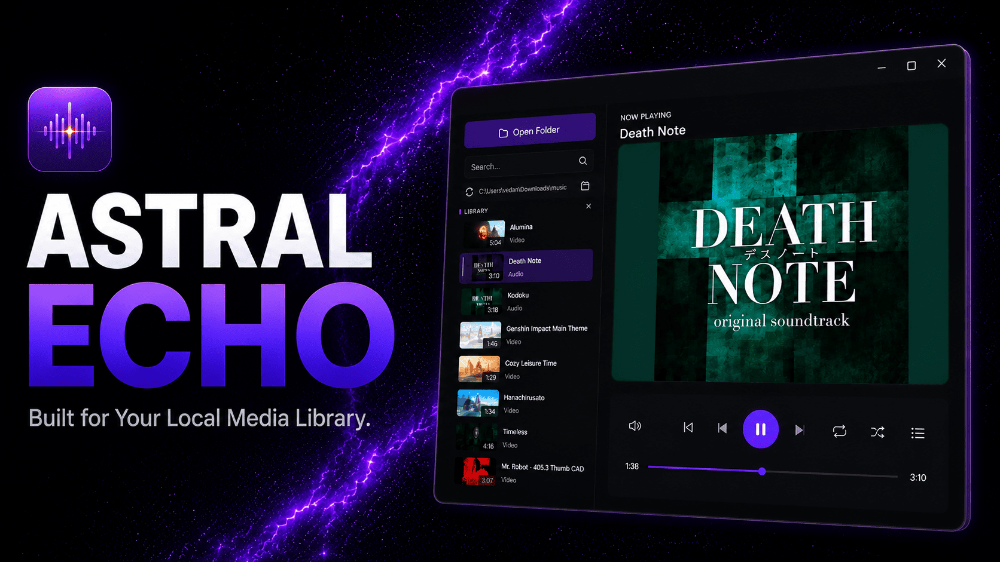
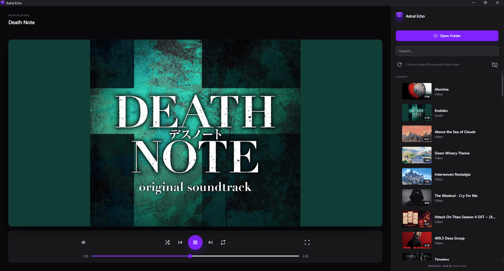
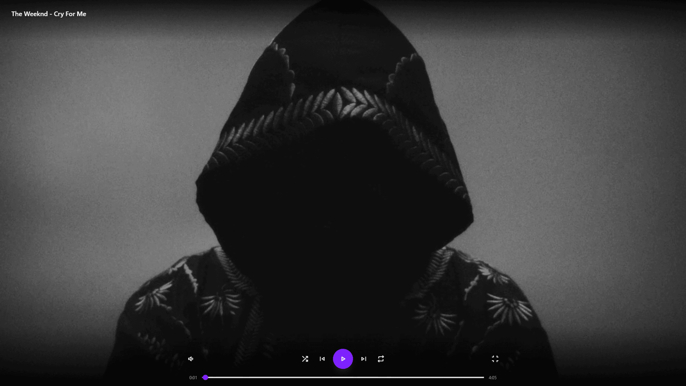
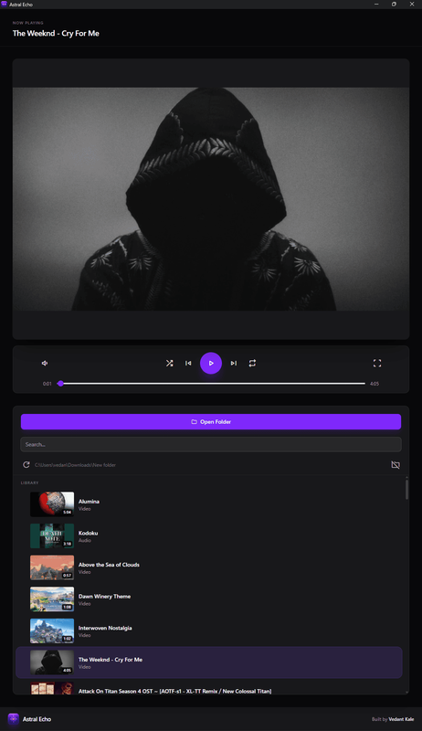

# 🌌 Astral Echo



<div style="text-align : center">


</div>

A fast, lightweight desktop media player built with Electron and TypeScript. Astral Echo scans a local folder for audio and video files, builds a searchable library, and plays media through a focused, minimal player interface with persistent state, drag-and-drop reordering, and full keyboard control.

## 📑 Table of Contents

- [Tech Stack](#-tech-stack)
- [Features](#-features)
- [Supported Media](#-supported-media)
- [Prerequisites](#-prerequisites)
- [Getting Started](#-getting-started)
- [Build & Package](#-build--package)
- [Quality Checks](#-quality-checks)
- [Project Structure](#-project-structure)
- [App Data](#-app-data)
- [Keyboard Shortcuts](#-keyboard-shortcuts)
- [License](#-license)
- [Screenshots](#-screenshots)
- [Author](#-author)

## 🛠️ Tech Stack

| Category        | Technology       |
| --------------- | ---------------- |
| App shell       | Electron         |
| Language        | TypeScript       |
| Styling         | Tailwind CSS     |
| Packaging       | electron-builder |
| Package manager | pnpm             |

## ✨ Features

**Playback**

- Play/pause, next/previous, shuffle, three-mode repeat (off / all / one)
- Seek, mute, volume control, fullscreen with auto-hiding controls and title overlay
- Media Session integration, OS-level media keys (Windows/Linux) and lock-screen controls
- On-screen volume, seek, and play/pause indicators

**Library**

- Recursive folder scanning for audio and video
- Auto-generated, searchable media library
- Drag-and-drop reordering, persisted per folder
- Video thumbnail generation, throttled and cached to disk
- Embedded audio artwork, title, and duration

**Persistence**

- Last opened folder and last played file, restored on launch
- Volume, shuffle, repeat mode, and sidebar width
- Window size and position

**UX**

- Keyboard shortcuts for all common playback actions
- Responsive portrait-mode layout for vertical monitors
- Toast notifications for playback and folder-loading errors
- Locally bundled icon font - fully offline, no external requests

## 🎞️ Supported Media

The main process scans for the following file extensions:

| Type  | Extensions                               |
| ----- | ---------------------------------------- |
| Audio | `.mp3`, `.wav`, `.flac`, `.m4a`, `.opus` |
| Video | `.mp4`, `.mkv`, `.webm`                  |

Playback support depends on Electron/Chromium codec availability, so some indexed files may not be playable on every system.

## ✅ Prerequisites

- Node.js 18 or later
- pnpm 9 or later

## 🚀 Getting Started

Install dependencies:

```bash
pnpm install
```

Start the app in development mode (runs Electron with TypeScript and CSS watchers):

```bash
pnpm dev
```

This runs the following concurrently:

- `pnpm watch:main` - recompiles the Electron main process on change
- `pnpm watch:renderer` - recompiles the renderer on change
- `pnpm electron` - launches the Electron app, restarting on rebuild
- `pnpm build:css:watch` - recompiles Tailwind CSS on change

## 🏗️ Build & Package

Compile TypeScript and CSS for production:

```bash
pnpm build
```

Run the compiled app directly, without packaging:

```bash
pnpm start
```

Build a distributable installer for your platform:

```bash
pnpm dist:win     # Windows: NSIS installer + portable exe
pnpm dist:linux   # Linux: AppImage + .deb
```

Or build an unpacked app directory (fast, useful for testing electron-builder output without generating a full installer):

```bash
pnpm pack
```

All packaged output is written to `release/`.

## 🔍 Quality Checks

```bash
pnpm lint            # Run ESLint
pnpm lint:fix        # Run ESLint and auto-fix
pnpm format          # Format files with Prettier
pnpm format:check    # Check formatting without writing changes
```

## 📁 Project Structure

```text
.
├── electron/
│   ├── main.cts
│   ├── preload.cts
│   ├── dev-runner.cjs
│   ├── ipc/
│   │   ├── settings.cts
│   │   ├── thumbnails.cts
│   │   ├── media.cts
│   │   └── system.cts
│   └── types/
│       └── media.ts
├── public/
│   └── assets/
│       ├── fonts/
│       └── ...
├── src/
│   └── renderer/
│       ├── app.ts
│       ├── modules/
│       │   ├── state.ts
│       │   ├── toast.ts
│       │   ├── template.ts
│       │   ├── player.ts
│       │   ├── library.ts
│       │   └── controls.ts
│       ├── electron.d.ts
│       ├── index.html
│       └── css/
├── dist/
├── release/
├── package.json
└── todo.md
```

## 💾 App Data

Settings and caches are stored in Electron's standard per-OS application data directory, under `astral-echo/`:

| OS      | Location                 |
| ------- | ------------------------ |
| Windows | `%APPDATA%\astral-echo\` |
| Linux   | `~/.config/astral-echo/` |

Two files live there:

- **`settings.json`** - last opened folder, last played file, volume, shuffle, repeat mode, sidebar width, window size/position, per-folder custom file order
- **`thumbnails.json`** - cached video thumbnails and durations, so they don't regenerate on every launch

## ⌨️ Keyboard Shortcuts

| Shortcut | Action                              |
| -------- | ----------------------------------- |
| `Space`  | Play / pause                        |
| `←`      | Seek backward 5s                    |
| `→`      | Seek forward 5s                     |
| `↑`      | Increase volume 5%                  |
| `↓`      | Decrease volume 5%                  |
| `M`      | Mute / unmute                       |
| `F`      | Toggle fullscreen                   |
| `N`      | Next item                           |
| `P`      | Previous item                       |
| `S`      | Toggle shuffle                      |
| `R`      | Cycle repeat mode (off → all → one) |
| `Escape` | Exit fullscreen                     |

## 📄 License

MIT © 2026 Vedant Kale

## 📸 Screenshots

<div style="text-align : center">

### Home



### Fullscreen



### Responsive Layout



</div>

## 👤 Author

Made with Electron & TypeScript by <a target="blank" href="http://vedantkale.in"> Vedant Kale.</a>
